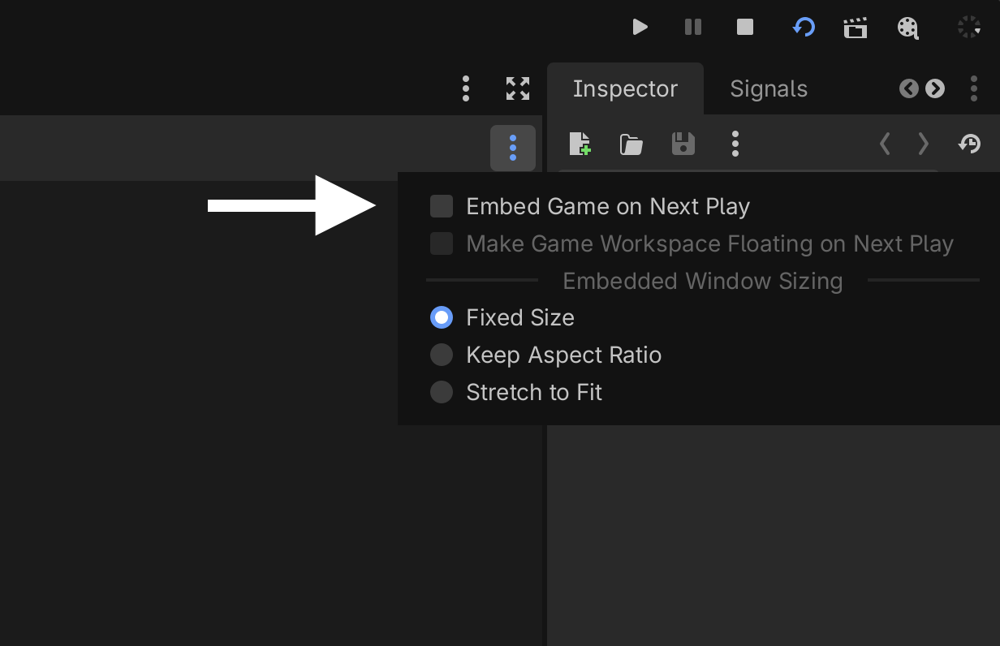

## Choose a presentation style

GodotRealityKit supports three presentation styles, configured in **Project > Project Settings > RealityKit > Presentation Style**:

- **Volumetric Window** (default) — Your game appears inside a resizable volume in your space. Use `RealityVolumeCamera3D` to define what part of your scene is visible.
- **Portal Window** — The window acts as a portal into your game world. The plugin reuses the project's perspective camera for the portal window.
- **Immersive** — Full immersive experience. Use `XROrigin3D` with the standard Godot XR workflow.

## Configure project settings

The plugin adds these settings under **Project > Project Settings > RealityKit**:

| Setting | Type | Default | Description |
|---|---|---|---|
| `reality_kit/presentation_style` | Enum | Volumetric Window | App presentation mode (Volumetric Window, Portal Window, Immersive) |
| `reality_kit/world_environment` | Enum | Automatic | World environment handling (Automatic, Enable, Disable) |
| `reality_kit/handles_game_controller_events` | Bool | true | Whether the app handles game controller input |
| `reality_kit/portal_presentation_world_scale` | Float | 0.0 | Fixed world scale for the Portal Window presentation style. When non-zero, this replaces the interactive world scale slider shown in the portal window. |
| `reality_kit/debug_rendering_on_macos` | Bool | false | Renders through RealityKit when running on macOS, instead of Godot's normal renderer. See [Preview with RealityKit on macOS](#preview-with-realitykit-on-macos). |

## Preview with RealityKit on macOS

GodotRealityKit always renders through RealityKit on visionOS. On macOS, it renders
through Godot's normal renderer by default, since RealityKit is meant for previewing rather
than shipping a macOS build. Enable **Project > Project Settings > RealityKit >
Debug Rendering On Macos** (`reality_kit/debug_rendering_on_macos`) to preview your scene
through RealityKit on macOS as well.

This only works if the running game is a separate, top-level window — not embedded inside
the editor. By default, Godot embeds the running game inside the editor's Game panel on
macOS, and an embedded game window doesn't get its own native surface for RealityKit to take
over. If `reality_kit/debug_rendering_on_macos` is enabled while the game is still embedded,
GodotRealityKit falls back to Godot's normal renderer and logs a warning.

To disable embedding, do one of the following:
- Uncheck **Embed Game on Next Play** in the Game panel's window-options menu. This is a
  per-project setting.

  

- Set **Editor Settings > Run > Window Placement > Game Embed Mode** to **Disabled**. This
  applies to every project opened with this editor.
