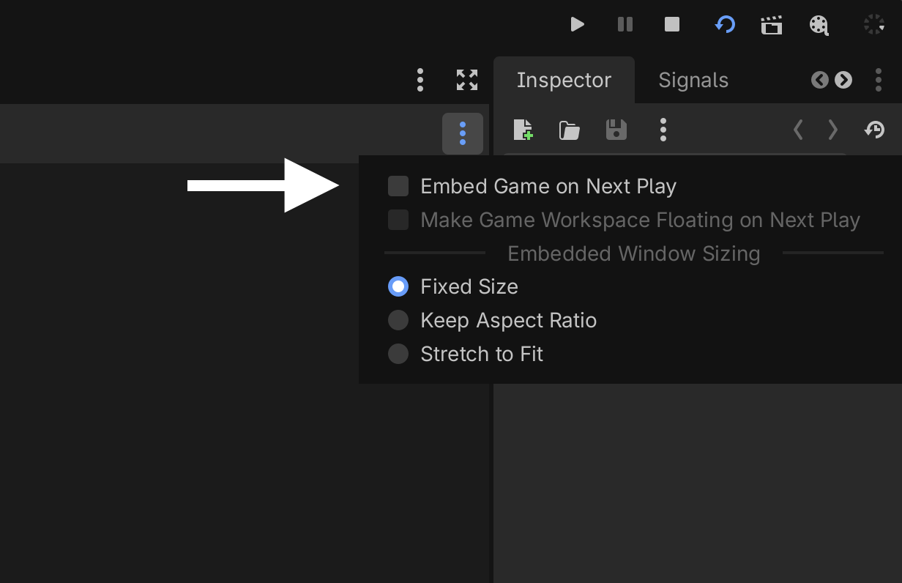

## Choose a presentation style

GodotRealityKit supports four presentation styles, configured in **Project > Project Settings > RealityKit > Presentation Style**:

- **Volumetric Window** (default) — Your game appears inside a resizable volume in your space. Use `RealityVolumeCamera3D` to define what part of your scene is visible.
- **2D Window** — The project's main Godot viewport stays in a native 2D window. Use `RealitySceneTree.open_volume_window()` to open separate RealityKit volumes. The main window can own a `FileDialog` and ordinary Godot controls without creating an empty primary volume.
- **Portal Window** — The window acts as a portal into your game world. The plugin reuses the project's perspective camera for the portal window.
- **Immersive** — Full immersive experience. Use `XROrigin3D` with the standard Godot XR workflow.

## Configure project settings

The plugin adds these settings under **Project > Project Settings > RealityKit**:


| Setting | Type | Default | Description |
|---|---|---|---|
| `reality_kit/presentation_style` | Enum | Volumetric Window | App presentation mode (Volumetric Window, 2D Window, Portal Window, Immersive) |
| `reality_kit/2d_window_placement` | Enum | Automatic | Initial placement of native Godot `Window` nodes on visionOS. `Utility Panel` brings the window close; `Leading`, `Trailing`, `Above`, and `Below` place it relative to the primary volumetric window. |
| `reality_kit/world_environment` | Enum | Automatic | World environment handling (Automatic, Enable, Disable) |
| `reality_kit/handles_game_controller_events` | Bool | true | Whether the app handles game controller input |
| `reality_kit/portal_presentation_world_scale` | Float | 0.0 | Fixed world scale for the Portal Window presentation style. When non-zero, this replaces the interactive world scale slider shown in the portal window. |
| `reality_kit/debug_rendering_on_macos` | Bool | false | Renders through RealityKit when running on macOS, instead of Godot's normal renderer. See [Preview with RealityKit on macOS](#preview-with-realitykit-on-macos). |

To override the project default for one `Window`, set its `gdrk_initial_placement`
metadata to `Automatic`, `Utility Panel`, `Leading`, `Trailing`, `Above`, or
`Below`. You can edit metadata in the Window inspector, or set it before showing
the window from GDScript:

```gdscript
$ControlsWindow.set_meta("gdrk_initial_placement", "Leading")
$ControlsWindow.show()
```

Directional placements refer to the primary RealityKit volume in Volumetric
Window mode. The same
relationship applies whether the volume or the 2D window opens first. If the
other window is not open yet, the system chooses the first window's position;
the second window is placed relative to it. Initial placement is a preference;
the person can move windows afterward. These settings have no effect on macOS.

In **2D Window** mode, the main scene is the Godot root viewport, and only
explicitly opened volumes create volumetric windows. The plugin hosts the
main Godot view in a SwiftUI 2D window while keeping it as native Godot window
ID 0, so its `FileDialog` continues to open the system Files picker. A volume
opened from this window is initially placed beside it; the person can move
either window afterward.

The controls window has one native instance because it owns Godot's main view
controller. Its initial size follows Godot's window width and height overrides
when they are positive, or the viewport size otherwise. Feature-specific project
settings such as `.visionos` are respected. The root [Window](https://docs.godotengine.org/en/stable/classes/class_window.html)
continues to control minimum and maximum size and whether resizing is allowed.

The primary 2D host uses the system's glass window background. To show it
behind Godot controls, enable `display/window/per_pixel_transparency/allowed`,
set the root `Window.transparent` property, and set its `transparent_bg`
property. Size and place controls within the Godot viewport; blank transparent
space still belongs to the native window and offsets its resize handle.

For example:

```gdscript
var volume_id := (get_tree() as RealitySceneTree).open_volume_window(
    "res://model_volume.tscn", "Model"
)
if volume_id >= 0:
    var volume_root := (get_tree() as RealitySceneTree).get_volume_window_root(volume_id)
    if not volume_root.is_node_ready():
        await volume_root.ready
    # The volume scene's @onready references are available here.
```

When called during the main scene's `_ready()`, `open_volume_window()` can
return before the new volume root finishes `_ready()`. Wait for its `ready`
signal before calling methods that use `@onready` references.

The system may restore a person's previous window positions. Apps can request
an initial position, but should keep controls usable if a model volume opens in
front of them.

The volume scene runs in its own viewport and 3D world. It can use
`RealityVolumeCamera3D` and spatial controller tracking as usual. The main
Godot viewport remains rendered in its 2D window while the volume is open or
closed. On macOS, the normal Godot viewport remains the 2D preview; opening
RealityKit volumes is a visionOS feature.

On visionOS, the plugin updates each native `Window` node's read-only
`gdrk_native_open` metadata. It is `false` while the native scene is opening
and after it closes, disconnects, or fails; it becomes `true` when the native
2D scene appears. Use `window.get_meta("gdrk_native_open", false)` when a Godot
interface needs to show a fallback control until the native window is ready.

## Preview with RealityKit on macOS

GodotRealityKit always renders through RealityKit on visionOS. On macOS, it renders
through Godot's normal renderer by default, since RealityKit is meant for previewing rather
than shipping a macOS build. Enable **Project > Project Settings > RealityKit >
Debug Rendering On Macos** (`reality_kit/debug_rendering_on_macos`) to preview your scene
through RealityKit on macOS as well.

This only works if the running game is a separate, top-level window — not embedded inside
the editor. By default, Godot embeds the running game inside the editor's Game panel on
macOS, and an embedded game window doesn't get its own native surface for RealityKit to take
over. If `reality_kit/debug_rendering_on_macos` is enabled while the game is still embedded,
GodotRealityKit falls back to Godot's normal renderer and logs a warning.

To disable embedding, do one of the following:
- Uncheck **Embed Game on Next Play** in the Game panel's window-options menu. This is a
  per-project setting.

  

- Set **Editor Settings > Run > Window Placement > Game Embed Mode** to **Disabled**. This
  applies to every project opened with this editor.
